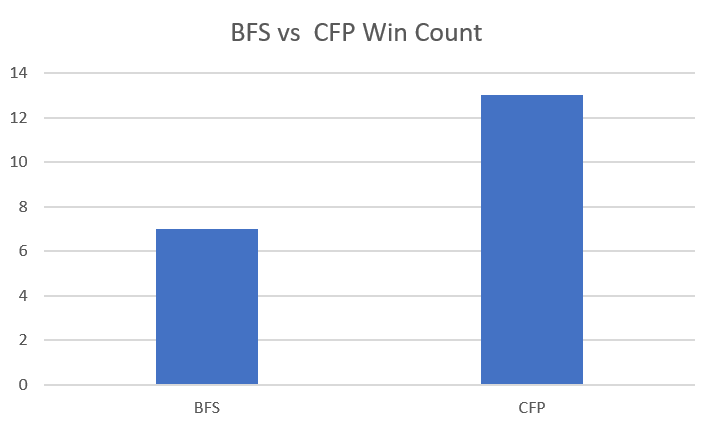
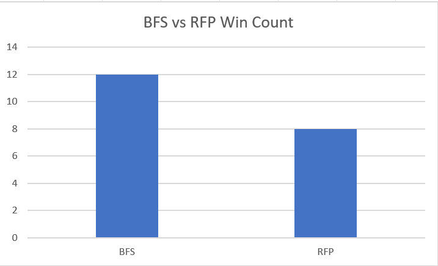
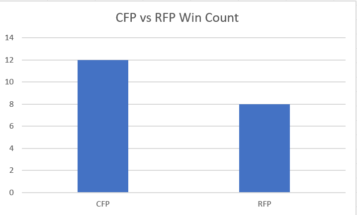

# 2023F CS2910 Project Report
**Group Members**
1. Dale Urquhart (0357083)
2. Sam Salu George (0356676)

# Summary of Game
_Quoridor is an abstract strategy board game where the goal is to navigate your pawn to the opposite side of the board. 
Players take turns either moving their pawn or placing walls to hinder opponents. 
The key objects include pawns representing each player and walls that can be strategically placed to create barriers. 
The game requires a balance of offense and defense, as players aim to reach their respective goals while impeding their opponents. 
For detailed rules and information, you can refer to : https://cdn.1j1ju.com/medias/fe/36/08-quoridor-rulebook.pdf_

# Experiment Report
## Player Strategies
1. Bread First Search (BFS): BFS strategy refers to a player movement strategy that tries to find the shortest path to the goal.
2. Close Fence Placement (CFP): CFS strategy refers to a fence placement strategy that places the fence closest to the opponent to restrict the opponent's movement.
3. Random Fence Placement (RFP): RSA strategy refers to a fence placement strategy that places the fence at random coordinates across the board.

## Procedure
_A description of your procedure for running the experiment on your code. This should include information 
regarding the setup of the experiment in terms of what it runs and how it compares the player strategies, 
the number of trials the experiment and what data was collected. (250 words)_

Our Simulation Runner has three methods: BFSvsCFS BFSvsRSA and B+CFSvsRSA each running a search algorithim (mentioned in method name) against another for twenty times utilizing mehtods in Board, Player, and Fence to explore the outcome of the game with the two strategys pitted against eachother. 

With the methods for running each simulation we are very easily able to keep the code nicely sectioned off into smaller methods. And can change what specifically we are runnning simulations for in any given test with ease as it just requires omitting or calling an extra method, or editing the number of iterations we are running for that method. 

20 trials for each combination of strategys was executed in the collection of our data.

Data collected was the winner of each of the 20 simulations, this was done by updating the game stat for each player's turn until a terminal one was reached and a winner was declared. A sum of total wins is continued through the 20 iterations and the win counts for each strategy is displayed at the end.

## Results
_A presentation on the results of your simulation of the strategies in table(s) or appropriate graphic(s) 
with a short summary. (250 words)_

**Image:**

**Table:**

| Strategy1 | Strategy2 | Win | Strategy1 Win Count | Strategy2 Win Count |
|-----------|-----------|-----|---------------------|---------------------|
| BFS       | CFP       | CFP | 7                   | 13                  |
| BFS       | RFP       | BFS | 12                  | 8                   |
| CFP       | RFP       | CFP | 12                  | 8                   |

CFS exhibited consistent success against both BFS and RSA.
BFS demonstrated strength against RSA, winning more matches in their head-to-head comparison.
Overall, CFS emerged as the most successful strategy, securing the majority of victories in its matches.

## Analysis
_An interpretation of your data explaining why one strategy is better than the other supported with 
data from your experiment.(500 words)_

Upon analyzing the data, it's evident that RFP seems to outperform BFS but falls slightly behind CFP. The counts show that RFP wins more frequently against BFS (12 wins for RFP versus 8 wins for BFS), indicating its superiority in that comparison. However, when pitted against CFP, RFP has fewer wins (8 wins for RFP versus 12 wins for CFP), suggesting CFP's comparative advantage over RFP.

In the BFS vs. CFP comparison, CFP emerges as the superior strategy, winning more often (13 wins for CFP versus 7 wins for BFS). This suggests that CFP is generally more effective than BFS based on the collected data.

These results contradict what i had expected, the BFS search is the only search that made movements on the shortest path to goal, however it did have the most primitive fence placing algorithim and placing a fence on 70% of its turns seems to not have helped it much. It seems better fence placing beats better move placing for this game. Making fence placements much more importnat than I had initially considered.

It will be interesting trying to implement a monte carlo search comparing both moves and fences for possible turns. It seems that intelegent fence placements will be the most challenging part of playing against the algorithim once it is completed since fence placements can so darastically change the landscape of the board.

It makes sense the CFP beat the RFP given the huge factor placement of fences plays since placing the fence closer to the opppoment makes the fence alot more likely to hinder the oppoments's path to goal. While this strategy still isnt optimal, it does have a more accurate function for palacing fences prioitizing spots close to theplayer compared to just the first valid spot we find on the board like BFS and RFS does.

Fine tuning on the ratio in which fences should be placed compared to making a movement could help improve these algorithims, or placing a fence in more optimal positions regarding the board state. 

In summary, based on the provided data, CFP appears to be the stronger strategy overall, winning more frequently in the comparisons with BFS and RFP. However, RFP shows strength against BFS, indicating a specific advantage in that comparison. It is disapointing to see the BFS strategy which makes smarter movements fare poorly compared to the other strategys, but with tuning of the paramaters and implementation of better search algorithims these strategies will hopefully pale in comparision to them.

# Reflection
_A reflection on your experiences with generative AI during this project. Provide a few sentences reflecting
on your experience with AI for each of the following prompts._ 

### What generative AI did you use, and what tasks did you use it for?
_ChatGPT: understanding how to implement probability_
_ChatGPT: reminding ourselves how copying of Arrays work_
_ChatGPT: research regarding different decorators for variables and methods for encapsulation_

### How did you learn about the tools used by your group (delete ones that don't apply)?
_Learned about ChatGPT through Instagram during its release and understood how it worked through Instagram reels and by experimenting in ChatGPT_

### Reflecting on your experience:
_Write a short reflection on your use of generative AI in this project, including if you did not use it. 
You may use the prompts as headings if you wish. (500 words)_  

**Prompts to think about in writing your reflections if you worked with generative AI:**
_Utilizing Generative AI in the Project
Generative AI played a pivotal role in addressing concise syntactical problems within the project. Specifically, it excelled in pinpointing issues related to failing to create copies of working array instances. By providing code samples and targeting the bugs within, the AI adeptly highlighted these critical syntactical errors. This streamlined our debugging process, enabling swift identification and rectification of these particular issues._

_Challenges Faced with Generative AI
However, limitations surfaced when dealing with larger code segments. Anything beyond a small block quickly became irrelevant to the initial inquiry, potentially prompting challenges in effectively utilizing the AI. This constraint hindered its broader applicability and effectiveness, demanding a more comprehensive approach for addressing complex code-related inquiries._

_Limitations and Knowledge Gaps
Moreover, the generative AI exhibited limitations in its knowledge base, notably lacking information on the board game Quoridor. Consequently, it struggled to provide relevant answers regarding the game's intricacies and rules. This knowledge gap highlighted the need for AI systems with more comprehensive databases, especially in niche or specialized domains._

_Impact on Project Evolution
Integrating the generative AI had both positive and negative impacts on the project's evolution. While it proved beneficial in addressing specific syntactical issues, its usage felt somewhat disjointed within the overall program structure. The AI's inclusion disrupted the flow when reviewing our code alongside the AI-generated content, creating a stylistic inconsistency._

_Unexplored Potentials and Future Plans
Furthermore, our initial attempt at implementing a Monte Carlo Tree Search algorithm for determining next moves and states encountered time constraints. Balancing this development with other academic commitments posed challenges, preventing the algorithm's complete fruition. Nonetheless, we aim to continue refining and implementing this algorithm in the future. This enhancement promises exciting possibilities, such as adapting heuristics for different difficulty levels, allowing for varied gameplay experiences._

_Reflections and Project Improvement
In hindsight, dedicating more time to the Monte Carlo Tree Search algorithm could have significantly elevated the project's quality. Despite encountering time limitations and academic obligations, allocating additional resources towards its development might have offered a more comprehensive and enriched gaming experience. Adjusting heuristics based on difficulty levels could have added depth to the gameplay, allowing for a nuanced and tailored user experience._

In conclusion, while the generative AI contributed positively by pinpointing syntactical issues, its limitations in handling larger code segments and domain-specific knowledge gaps posed challenges. The unfulfilled potential of implementing advanced algorithms like the Monte Carlo Tree Search for gameplay enhancement highlights a promising avenue for future development and improvement in the project.

# Bonus Consideration:
If you have aspects of your project you would like considered for the available bonus.